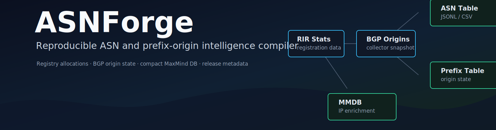

# ASNForge

ASNForge builds reproducible ASN and prefix-origin intelligence artifacts for IP enrichment, routing analytics, and security data pipelines. It compiles public registry and routing inputs into a compact IP-to-ASN MaxMind DB, canonical ASN tables, prefix-origin snapshots, build metadata, checksums, and release-ready archives.

<p align="center">
  
</p>

<p align="center">
  <a href="https://github.com/ipanalytics/ASNforge/actions/workflows/ci.yml"></a>
  <a href="https://github.com/ipanalytics/ASNforge/releases"></a>
  <a href="./LICENSE"></a>
  
  
  <a href="https://ipanalytics.github.io/ASNforge/"></a>
</p>

---


<!-- ASNFORGE:RELEASE-STATS BEGIN -->
## Latest Release Stats

| Field | Value |
| --- | ---: |
| Build ID | `20260525-081859Z` |
| Profile | `public-safe` |
| Generated | `2026-05-25T08:18:59Z` |
| Quality | `PASS` |
| ASN profiles | 137,473 |
| Named ASN profiles | 120,775 |
| Prefixes | 1,447,652 |
| MMDB inserted prefixes | 1,447,652 |
| MOAS prefixes | 14,589 |
| Private ASN records | 200 |
| Reserved ASN records | 28 |
| Unknown type ASNs | 123,406 |
| Build duration seconds | 62.13 |

## Sources

| Name | URL | Size | SHA256 |
| --- | --- | ---: | --- |
| `afrinic` | [delegated-afrinic-extended-latest](https://ftp.afrinic.net/pub/stats/afrinic/delegated-afrinic-extended-latest) | 976,819 | `1444ac65c7c3` |
| `apnic` | [delegated-apnic-extended-latest](https://ftp.apnic.net/stats/apnic/delegated-apnic-extended-latest) | 8,942,658 | `ea3b22ce1282` |
| `arin` | [delegated-arin-extended-latest](https://ftp.arin.net/pub/stats/arin/delegated-arin-extended-latest) | 12,802,696 | `945a9a8a9cbb` |
| `lacnic` | [delegated-lacnic-extended-latest](https://ftp.lacnic.net/pub/stats/lacnic/delegated-lacnic-extended-latest) | 4,508,976 | `c96da8ec6bdb` |
| `ripe` | [delegated-ripencc-extended-latest](https://ftp.ripe.net/pub/stats/ripencc/delegated-ripencc-extended-latest) | 17,857,762 | `c41f3fd467e8` |
| `ed2d58969c8c-table.jsonl` | [table.jsonl](https://bgp.tools/table.jsonl) | 74,737,521 | `59bbae2f225f` |
| `asn_catalog` | [asns.csv](https://bgp.tools/asns.csv) | 5,512,379 | `af6cbce76ffc` |
| `asn_signals` | [asn-signals.csv](https://raw.githubusercontent.com/ipanalytics/IP-Knowledge-Layer/main/data/current/asn-signals.csv) | 119 | `f27bb5dba8a1` |
| `asn_signals` | [asn-signals.csv](https://raw.githubusercontent.com/ipanalytics/ASN-Signal-Graph/main/data/current/asn-signals.csv) | 607,980 | `8185705bddfa` |

## Artifacts

| Artifact | Size | Records |
| --- | ---: | ---: |
| `asnforge-asn.csv.gz` | 2,828,794 | 137,473 |
| `asnforge-asn.jsonl.gz` | 3,580,577 | 137,473 |
| `asnforge-diff.json` | 224 | - |
| `asnforge-prefixes.csv.gz` | 8,837,401 | 1,447,652 |
| `asnforge-prefixes.jsonl.gz` | 10,737,358 | 1,447,652 |
| `asnforge.mmdb.gz` | 6,077,413 | 1,447,652 |
| `manifest.json` | 3,719 | - |
| `quality-report.md` | 2,664 | - |

## Numeric Diff

| Metric | Value |
| --- | ---: |
| `baseline` | true |
| `new_asns` | 0 |
| `removed_asns` | 0 |
| `changed_asn_profiles` | 0 |
| `new_prefixes` | 0 |
| `removed_prefixes` | 0 |
| `changed_prefix_origins` | 0 |
| `new_moas_prefixes` | 0 |
| `resolved_moas_prefixes` | 0 |

## Quality

No warnings or errors.
<!-- ASNFORGE:RELEASE-STATS END -->
## Overview

ASNForge is a local compiler for ASN profile and prefix-origin datasets. It is designed for teams that need deterministic, inspectable artifacts instead of ad hoc enrichment files assembled by scripts.

The v0.1 pipeline ingests RIR delegated stats, bgp.tools prefix-origin and ASN catalog exports, static ipanalytics signal feeds, normalized local inputs, and curated overrides. It emits stable JSONL/CSV tables for analytics and joins, plus a compact MaxMind DB for latency-sensitive IP enrichment.

The compiler records build identifiers, schema versions, source hashes, artifact hashes, quality results, and release manifests so generated data can be traced and compared across builds.

## System Behavior

```text
RIR delegated stats     manual overrides
        │                    │
        ▼                    ▼
   ASN allocation table ── ASN profile normalization
        │                    │
        │                    ▼
BGP prefix-origin feed ── prefix-origin aggregation ── MOAS policy
        │                    │
        ├───────────────┬────┴───────────────┐
        ▼               ▼                    ▼
  ASN JSONL/CSV   Prefix JSONL/CSV       Compact MMDB
  ASN -> profile  prefix -> origins      IP -> ASN profile
```

ASNForge produces three related artifact families:

| Artifact | Access pattern | Role |
| --- | --- | --- |
| `asnforge.mmdb` | IP address -> origin ASN profile | Prefix-keyed MaxMind DB for local enrichment |
| `asnforge-asn.jsonl` / `.csv` | ASN -> ASN profile | Canonical table for direct ASN lookup and joins |
| `asnforge-prefixes.jsonl` / `.csv` | Prefix -> observed origin state | Prefix-origin snapshot with MOAS and collector state |

## Features

- RIR delegated extended parser for ASN allocation records.
- Normalized BGP prefix-origin CSV/TSV parser with collector-aware aggregation.
- bgp.tools bulk table parser for production prefix-origin snapshots.
- bgp.tools ASN catalog parser for ASN names and coarse source classes.
- Static ASN signal enrichment from IP-Knowledge-Layer and ASN-Signal-Graph.
- Conservative name-based classification fallback for obvious ASN categories.
- Manual ASN overrides for curated name, organization, type, tags, confidence, and field sources.
- MOAS handling with deterministic policies: `mark_ambiguous`, `most_observed`, `lowest_asn`.
- Private and reserved ASN handling with `flag`, `drop`, and `keep` policies.
- Compact MaxMind DB writer for IP-prefix lookups.
- Stable JSONL and CSV outputs with fixed headers and sorted records.
- Build metadata with source hashes, artifact hashes, schema version, build id, and quality verdict.
- Smoke tests, validation command, checksums, release manifest, and baseline diff output.
- GitHub Actions CI and release workflow for scheduled or tag-driven artifact publication.

## Quick Start

The local development profile is deterministic and does not require network access.

```sh
go run ./cmd/asnforge build \
  --config config/local-dev.yaml \
  --out release/current \
  --build-id local-dev

go run ./cmd/asnforge validate --out release/current --strict
```

Inspect generated data:

```sh
go run ./cmd/asnforge inspect-ip 8.8.8.8 \
  --mmdb release/current/asnforge.mmdb \
  --format json

go run ./cmd/asnforge inspect-asn 15169 \
  --asn-table release/current/asnforge-asn.jsonl

go run ./cmd/asnforge stats --out release/current --format json
```

## Installation

Build from source:

```sh
git clone https://github.com/ipanalytics/ASNforge.git
cd ASNforge
go build -o asnforge ./cmd/asnforge
```

Run the compiler:

```sh
./asnforge build --config config/local-dev.yaml --out release/current
./asnforge validate --out release/current --strict
```

Requirements:

| Component | Version |
| --- | --- |
| Go | 1.22 or newer |
| OS | Linux, macOS, or any environment supported by Go |
| Network | Required only for configured HTTP source downloads |

## CLI

```text
asnforge build
asnforge download
asnforge validate
asnforge inspect-ip <ip>
asnforge inspect-asn <asn>
asnforge stats
asnforge version
```

Common flags:

| Flag | Default | Description |
| --- | --- | --- |
| `--config` | `config/public-safe.yaml` | Build configuration |
| `--out` | `release/current` | Release output directory |
| `--cache` | `data/cache` | Source cache directory |
| `--build-id` | UTC timestamp | Explicit build identifier |
| `--schema-version` | `asnforge.v0.1` | Artifact schema version |
| `--private-asn-policy` | config value | `flag`, `drop`, or `keep` |
| `--moas-policy` | config value | `mark_ambiguous`, `most_observed`, or `lowest_asn` |
| `--mmdb` | `<out>/asnforge.mmdb` | MMDB path for build or inspect |
| `--skip-download` | `false` | Use cached/local source files |
| `--strict` | `false` | Treat quality warnings as build failures |
| `--format` | `text` | `text` or `json` where supported |

## Outputs

A successful build writes a complete release directory:

```text
release/current/
├── asnforge.mmdb
├── asnforge.mmdb.gz
├── asnforge-asn.jsonl
├── asnforge-asn.jsonl.gz
├── asnforge-asn.csv
├── asnforge-asn.csv.gz
├── asnforge-prefixes.jsonl
├── asnforge-prefixes.jsonl.gz
├── asnforge-prefixes.csv
├── asnforge-prefixes.csv.gz
├── metadata.json
├── checksums.txt
├── quality-report.md
├── asnforge-diff.json
└── manifest.json
```

| File | Description |
| --- | --- |
| `asnforge.mmdb` | Compact MaxMind DB for IP -> ASN profile lookup |
| `asnforge-asn.jsonl` | Canonical ASN profile table |
| `asnforge-asn.csv` | CSV form of the ASN profile table |
| `asnforge-prefixes.jsonl` | Canonical prefix-origin snapshot |
| `asnforge-prefixes.csv` | CSV form of prefix-origin state |
| `metadata.json` | Build metadata, source hashes, artifact hashes, summary, quality verdict |
| `checksums.txt` | SHA256 checksums for release artifacts |
| `quality-report.md` | Human-readable build and quality report |
| `asnforge-diff.json` | Baseline or release-to-release diff shape |
| `manifest.json` | Machine-readable artifact manifest |

## Data Formats

Every primary record includes:

- `schema_version`
- `build_id`

These fields make joins explicit and prevent accidental mixing of incompatible builds.

### ASN Profile

`asnforge-asn.jsonl` and `asnforge-asn.csv` contain one row per ASN:

```json
{
  "schema_version": "asnforge.v0.1",
  "build_id": "local-dev",
  "asn": 15169,
  "asn_name": "Google LLC",
  "asn_org": "Google",
  "asn_type": "cloud",
  "asn_tags": ["cloud", "dns", "manual-override", "search"],
  "registration_country": "US",
  "rir": "arin",
  "asn_confidence": 100
}
```

`registration_country` is the registry allocation country from RIR delegated data. It is not user, host, or service geolocation.

### Prefix Origin

`asnforge-prefixes.jsonl` and `asnforge-prefixes.csv` preserve routing observation state:

```json
{
  "prefix": "8.8.8.0/24",
  "origin_asns": [15169],
  "selected_origin_asn": 15169,
  "moas": false,
  "origin_policy": "most_observed",
  "observation_count": 2,
  "source_collectors": ["ris-rrc00", "routeviews2"],
  "prefix_confidence": 90,
  "rpki_state": "unknown"
}
```

### MMDB Record

The MMDB is prefix-keyed and optimized for local IP enrichment:

```json
{
  "schema_version": "asnforge.v0.1",
  "build_id": "local-dev",
  "asn": 15169,
  "asn_name": "Google LLC",
  "asn_org": "Google",
  "asn_type": "cloud",
  "asn_tags": ["cloud", "dns", "manual-override", "search"],
  "registration_country": "US",
  "rir": "arin",
  "moas": false,
  "asn_confidence": 100
}
```

Detailed MOAS state, origin arrays, collector observations, and field-level provenance belong in the prefix and ASN tables. Keeping those fields out of the MMDB preserves data-section deduplication and keeps the database compact.

## Operational Notes

- Builds are deterministic for the same inputs, config, schema version, and build id.
- ASN rows are sorted by numeric ASN.
- Prefix rows are sorted by IP family, address bytes, and prefix length.
- CSV list fields use semicolon-separated stable ordering.
- `metadata.json` records source paths, URLs, SHA256 hashes, sizes, generated time, artifact hashes, and quality summary.
- `validate --strict` is intended for CI and release workflows.

## Source Profiles

| Profile | Purpose | Network required |
| --- | --- | --- |
| `config/local-dev.yaml` | Deterministic development and CI fixture build | No |
| `config/public-safe.yaml` | Public-safe release profile using RIR delegated files, bgp.tools exports, and static ipanalytics ASN signal feeds | Yes |
| `config/research-caida.yaml` | Public-safe sources plus optional CAIDA ASRank, AS2Org, and AS relationships bulk files | Yes, plus operator-provided CAIDA files |

The public-safe profile downloads `https://bgp.tools/table.jsonl` for production prefix-origin input, `https://bgp.tools/asns.csv` for ASN names and source classes, and static raw CSV signal exports from IP-Knowledge-Layer and ASN-Signal-Graph. The deterministic fixture under `examples/testdata` is intentionally scoped to `config/local-dev.yaml`.

The research CAIDA profile is separate because CAIDA datasets have their own acceptable-use, citation, and redistribution terms. CAIDA fields are written to the ASN JSONL/CSV artifacts and are intentionally excluded from the compact MMDB.

Default CAIDA research inputs:

| Dataset | File |
| --- | --- |
| AS2Org | `https://publicdata.caida.org/datasets/as-organizations/latest.as-org2info.txt.gz` |
| AS relationships | Latest `*.as-rel2.txt.bz2` resolved from `https://publicdata.caida.org/datasets/as-relationships/serial-2/` |
| ASRank | Operator-provided CSV path or URL; ASRank API crawling is not used |

The repository includes a monthly/manual `release-caida` workflow that publishes a prerelease tagged `research-caida-YYYYMMDD-HHMMSSZ`.

The v0.1 public-safe profile does not include CAIDA data by default. Optional PeeringDB, CAIDA, RPKI, and native MRT support are tracked as later source profiles and parser extensions.

## Use Cases

- IP enrichment in SIEM, fraud, abuse, and traffic analytics systems.
- Local ASN profile joins in data warehouses and stream processors.
- Prefix-origin snapshots for routing analytics and MOAS review.
- Reproducible release artifacts for internal security data pipelines.
- Build-time validation of third-party registry and routing source changes.

## Scope

ASNForge v0.1 focuses on the pipeline shape: parsers, normalized models, deterministic outputs, compact MMDB generation, metadata, validation, and release automation.

Classification is conservative. `asn_type` is a scored operational classification, not an authoritative registry fact. Confidence describes source agreement, completeness, or observation strength; it is not a risk score.

## Limitations

- Native MRT parsing is not implemented in v0.1.
- Prefix-origin input is normalized CSV/TSV.
- RPKI state defaults to `unknown`.
- ASN classification is intentionally sparse without optional enrichment sources.
- Live routing data varies by collector and collection time.

## Directory Structure

```text
.
├── cmd/asnforge/          # CLI entry point
├── internal/asn/          # ASN models, classification, private/reserved policy
├── internal/bgp/          # Prefix-origin parser and aggregation
├── internal/build/        # Build pipeline, metadata, quality, diff
├── internal/config/       # Config loading and CLI options
├── internal/download/     # Source download, hashing, source state
├── internal/mmdb/         # MaxMind DB writer and inspector
├── internal/output/       # JSONL, CSV, gzip, checksums
├── internal/rir/          # RIR delegated parser
├── internal/smoke/        # Smoke test runner
├── config/                # Build profiles
├── schemas/               # JSON Schemas
├── examples/              # Overrides, smoke cases, deterministic testdata
├── docs/                  # Data source and artifact documentation
└── .github/workflows/     # CI and release automation
```

## Deployment

Release artifacts are intended to be published through GitHub Releases, not committed to the repository.

The release workflow builds the CLI, runs the configured public-safe build, validates the output, computes checksums, creates a release tag, and uploads compressed data artifacts plus metadata:

```sh
./asnforge build --config config/public-safe.yaml --out release/current
./asnforge validate --out release/current --strict
```

For internal deployments, run the same commands in CI and publish `release/current/*` to object storage, package registries, or internal artifact repositories.

## Documentation

- [Data Sources](docs/DATA_SOURCES.md)
- [Third-Party Data](docs/THIRD_PARTY_DATA.md)
- [Classification](docs/CLASSIFICATION.md)
- [MMDB Output](docs/MMDB_OUTPUT.md)
- [Release Artifacts](docs/RELEASE_ARTIFACTS.md)
- [Confidence](docs/CONFIDENCE.md)

## License

ASNForge is licensed under the [Apache License 2.0](LICENSE).

## Disclaimer

ASNForge aggregates registry and observed routing data for defensive, analytical, and operational use. Routing data is observational and may differ by collector and collection time.
